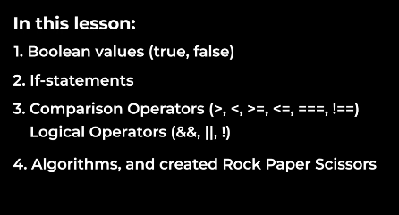

**JavaScript Logical Operators and Short-Circuiting:**

1. **Logical AND Operator (`&&`):**
   - `console.log(true && true);`
     - Output: `true`

2. **Logical OR Operator (`||`):**
   - `console.log(null || false);`
     - Output: `false`

3. **Logical NOT Operator (`!`):**
   - `console.log(!false);`
     - Output: `true`

4. **Ternary Operator (`? :`):**
   - `let TO = false ? "amazing" : "this is False";`
   - `console.log(TO);`
     - Output: `this is False`
   - *Advantage:* Allows for concise conditional expressions.

5. **Guard Operator (`&&`):**
   - Blocks the statement execution if the value is `false`.
   - Example:
     ```javascript
     let var2 = false && console.log('Hello');
     // No output as the condition is false
     ```

6. **Default Operator (`||`):**
   - Provides a default value if the first operand is falsy.
   - Example:
     ```javascript
     let currency = 'EUR' || 'USD';
     // 'EUR' is truthy, so currency is assigned 'EUR'
     ```

7. **Short-Circuiting:**
   - Refers to the behavior where the second operand is not evaluated if the first operand is sufficient to determine the result.

8. **Truthy and Falsy Values:**
   - Truthy values: Values that evaluate to `true` in a boolean context (e.g., non-zero numbers, non-empty strings).
   - Falsy values: Values that evaluate to `false` in a boolean context (e.g., `0`, `null`, `undefined`).

9. **Reducing Condition Length:**
   - Utilize truthy and falsy values to simplify conditions.
     ```javascript
     let a = 5;
     if (a) {
       console.log('cart has items');
     }
     // 'a' acts as a truthy value, eliminating the need for explicit comparison (e.g., a > 0).
     ```

10. **Other Examples:**
    ```javascript
    if (true) {
      console.log('truthy');
    }
    // The block will be executed because the condition is true.

    console.log(!0);
    // Output: true (negation of falsy value)
    ```

These JavaScript concepts provide a powerful way to manage conditional logic and enhance code readability.


